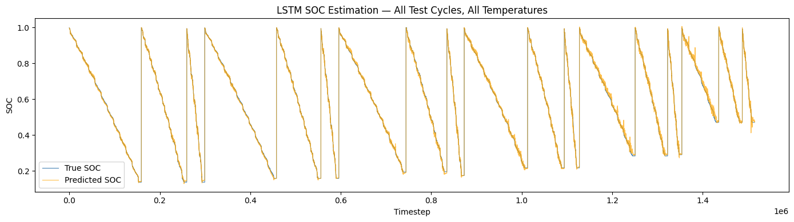

Deep-Learning SOC Estimator for Energy Storage Systems

The Business Problem 

Inaccurate battery State of Charge (SOC) estimation forces energy providers and EV manufacturers to "over-provision" battery capacity to ensure safety, leading to millions in wasted Capital Expenditure (CapEx). Furthermore, extreme thermal conditions degrade battery performance unpredictably. This project solves this by using deep learning to accurately predict SOC in real-time, enabling leaner battery packs, extended hardware lifespan, and highly reliable edge-grid backups.

The Technical Solution

Engineered a Long Short-Term Memory (LSTM) neural network using PyTorch to process high-frequency time-series sensor data (Voltage, Current, Temperature).
Architecture: 3-feature input, 100-unit hidden LSTM layer, mapping to a continuous SOC output.
Pipeline: Implemented a custom PyTorch Dataset with a 400-timestep sliding window.
Data Integrity: Strict isolation of Train/Val/Test splits to prevent data leakage. Scalers (MinMaxScaler) were fit only on the training set.

The Dataset
Utilized the LG HG2 Battery Dataset (McMaster University). The model was trained and evaluated across highly volatile drive cycles (UDDS, LA92, US06, Mixed) under extreme thermal stress testing, ranging from -20°C to +40°C.

Results
The model achieved highly robust performance on completely unseen test cycles:
Overall Test RMSE: 0.7933%
Overall Test MAE: 0.5539%

Tech Stack
Python, PyTorch, Pandas, NumPy, Scikit-Learn, Matplotlib
